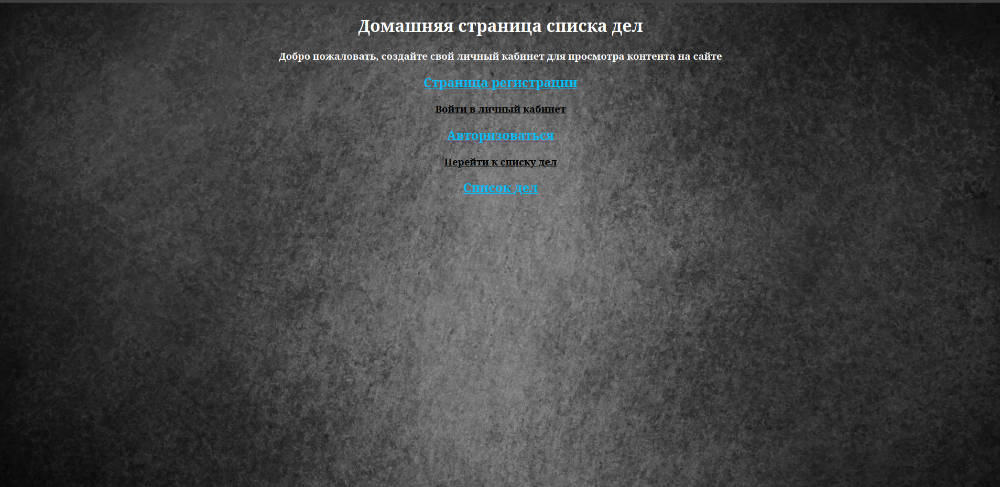

<h2>Сайт планировщик на flask-sqlalchemy</h2>

    Чтобы развернуть проект на пк:
    
    КОМАНДЫ:

    Активируйте вирт-е окружение:
        1)python3 -m venv venv
        2)source venv/bin/activate
    
    Установите файл с зависимостями:
        1)pip install -r requements.txt 
    
    Создайте файл config.py
        1)пропишите переменную SECRET='{ВАШ СЕКРЕТНЫЙ КЛЮЧ}' 
    
    Запустите проект в файле app.py
        
<h2>В проекте реализовано следующее</h2>
    
    1)Регистрация пользователей
        1.1 все пароли хэшируются
        1.2 при вводе логина (email) , логин будет проходить валидацию 
    2)Авторизация
        2.1 Если пользователя не сущ в бд , то будет выводиться соответствующее
        сообщение
        2.2 Если пользователь есть в бд будет происходить перенаправление на домашнюю страницу
                            
        Домашняя страница

        Страница регистрации

При повторной регистрации пользователя выводится flash() cообщение,что пользователь уже существует

Когда пользователь вводит различные пароли при регистрации выскакивает flash() сообщение

Когда мы соблюдаем всю валидацию и нажимаем "Зарегистрироваться" у нас идет перенаправление на страницу дополнительной авторизации

Так же мы видими, что пользователь добавлен в бд и время его добавления

